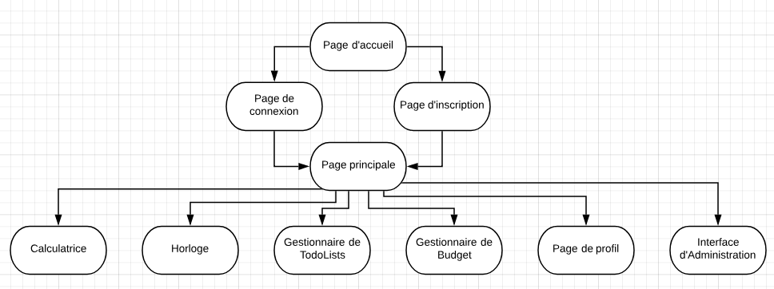
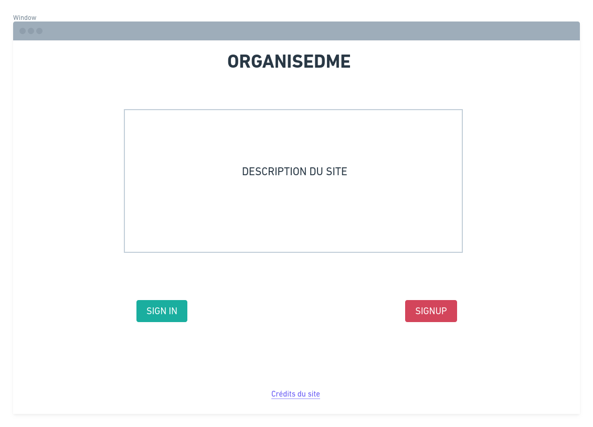
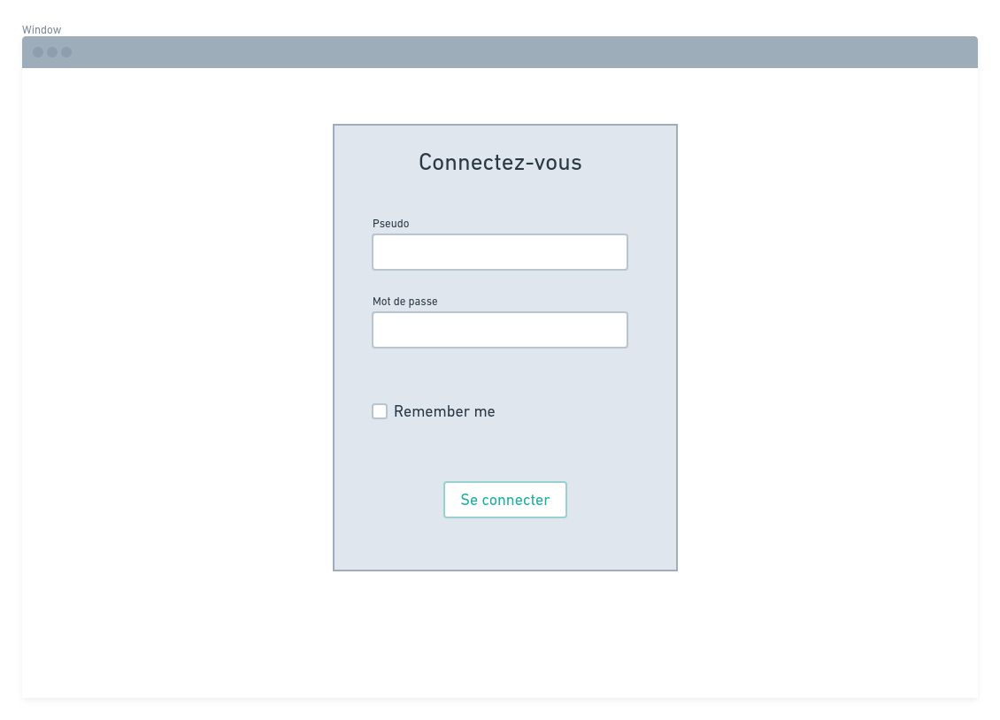
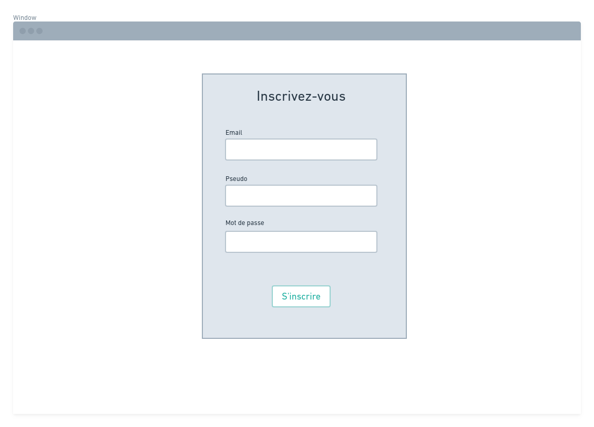
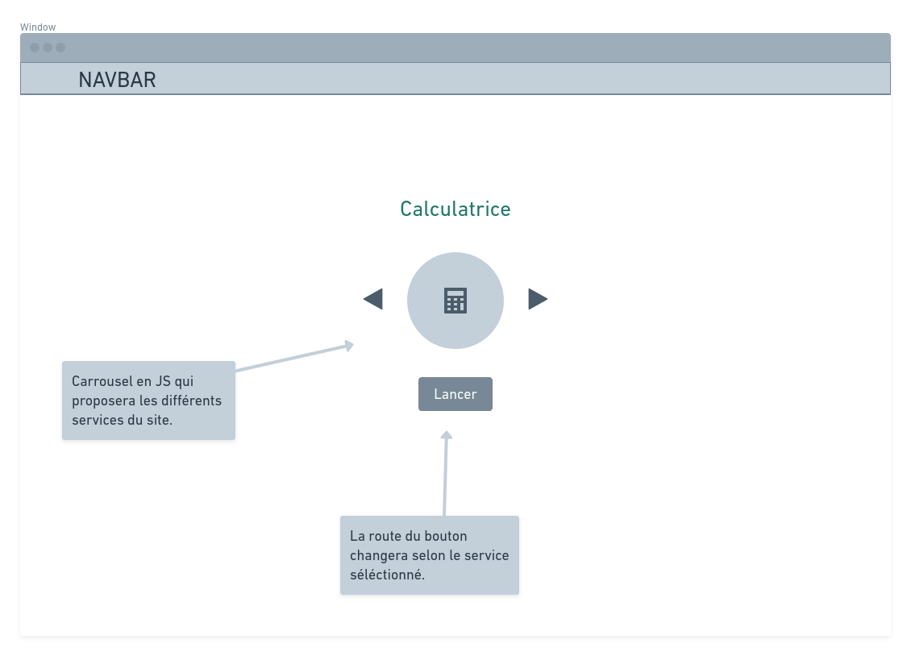
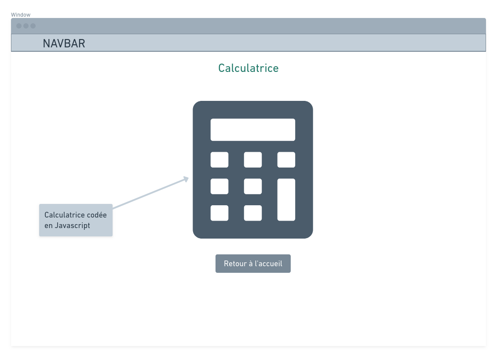
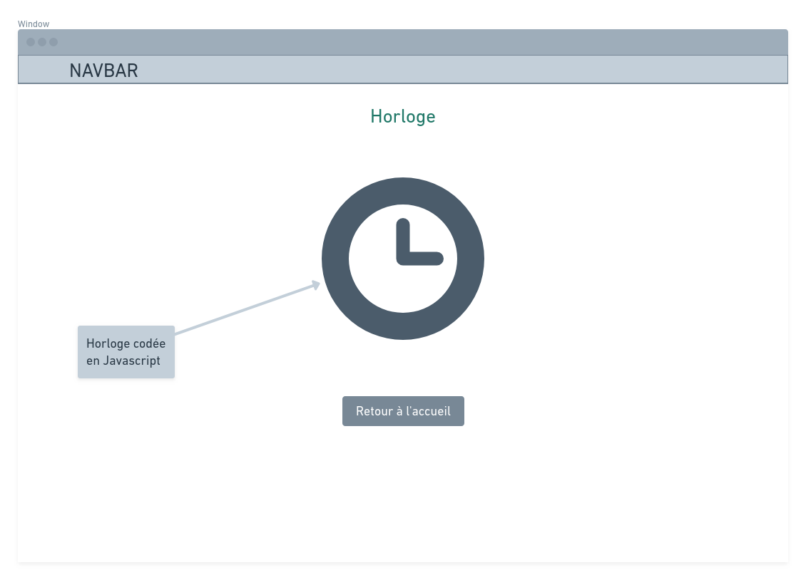
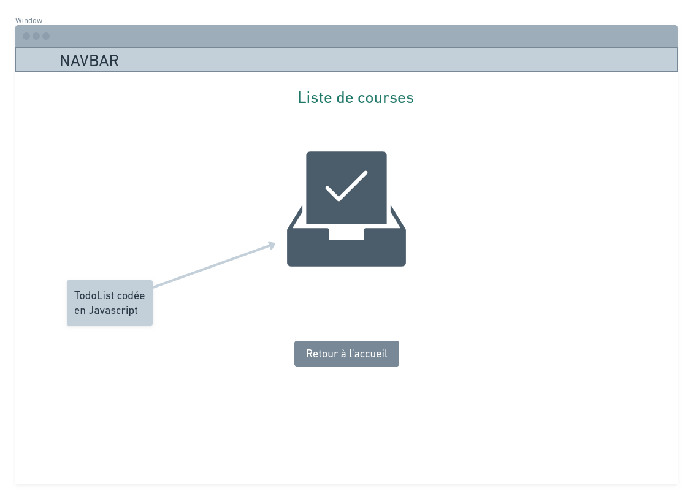
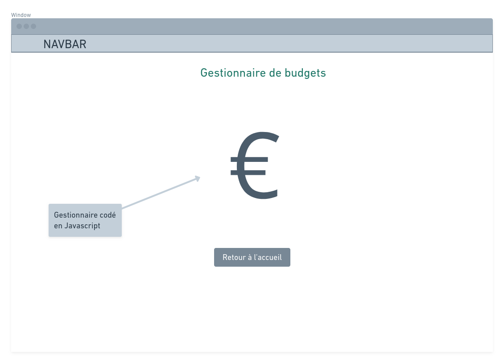
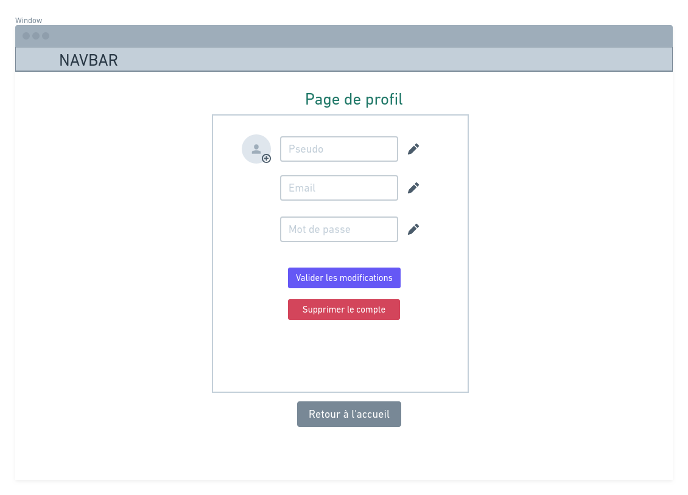

# Cahier des charges `organisedme`
​
*Projet imaginé et développé par Le Maitre Sulivan. Cahier des charges rédigé par Le Maitre Sulivan.*
​
​
​
## Navigation du Cahier des charges
​
​
​
- Le contexte 
- Les objectifs du projet
- Les fonctionnalités du projet
- Les rôles utilisateurs
- Les technologies utilisées
- Les "user-stories"
- Liste des routes
- Public visé
- Potentielles évolutions
- Workflow
- Wireframes
​
​
​
​
​
## Le contexte
​
​
​
Le but de cette application sera d'offrir une solution sous forme d'interface web, proposant plusieurs outils utilitaires pour l'utilisateur et de centraliser tous ces outils via une seule et même interface.
​
​
​
## Les objectifs du projet
​
​
​
- Avoir une interface proposant une navigation dynamique
​
- Proposer en premier lieu ces services : calculatrice, horloge, liste de courses, gestionnaire de budget
​
- Pouvoir se connecter
​
  
​
## Les fonctionnalités du projet
​
​
​
- Se connecter / S'inscrire
​
- Avoir une interface d'accueil
​
- Un accordéon avec les icônes des différents services proposés
​
- Avoir une calculatrice sans sauvegarde de requêtes
​
- Avoir une horloge réglée sur l'heure européenne avec un bouton affichant l'heure chiffrée (accessibilité)
​
- Avoir une liste de courses (Todo-list) avec sauvegarde de requêtes pour avoir un historique des anciennes listes
​
- Avoir un gestionnaire de budget avec un budget à définir, une liste d'achats effectués, dont les valeurs seront déduites du budget sus-défini
​
- Proposer un thème clair et un thème sombre (accessibilité)
​
  
​
## Les rôles utilisateurs
​
​
​
#### L'administrateur
------
Il est celui que s'occupe de la gestion globale du site. En effet, il s'occupera du maintien des différents services du site, ainsi que des modifications. Il aura la main sur le CRUD (Create / Read / Update / Delete) des users.
​
#### L'user connecté
------
L'user connecté aura accès à l'ensemble du site, outre l'espace d'administration. Il aura accès à l'ensemble des services proposés par le site. Il aura une session qui lui permettra d'avoir une sauvegarde des anciennes listes de courses, lui permettant d'avoir un historique pour construire ses habitudes d'achats, et aussi pour le gestionnaire de budget, permettant d'avoir l'historique des budgets établis par le passé.
​
#### Le visiteur
------
Le visiteur est celui qui ne détient pas de compte actif. Il n'aura pas d'accès aux services, et sera invité à se connecter ou à s'inscrire dès la page d'accueil.
​
​
​
## Les technologies utilisées
​
​
​
Le site sera construit via le framework PHP **Symfony**. Toute la partie back-end sera gérée par ce même framework. Des composants du framework seront utilisés : **ORM-Pack** pour la connexion à une BDD pré-établie via **Doctrine**, **Twig** pour la gestions des vues HTML, **Annotations** pour la gestion des configurations des routes via les controllers, **Admin** pour la création de l'interface d'administration via **EasyAdmin**, **Profiler** pour avoir une débug-bar pendant la phase de développement du site et **Security-bundle** pour avoir tous les composants de sécurité génériques pré-configurés.
​
Les composants du site seront codés en **Javascript** en **Vanilla** ou en **jQuery**, avec une gestion du **DOM** afin de permettre les interactions avec l'utilisateur. Les liaisons entre le back-end et le front-end se fera via des requêtes **AJAX**.
​
​
​
## Les User-Stories
​
​
​
| En tant que... | J'ai besoin de...               | Afin de...                                              | Commentaire                                                  |
| -------------- | ------------------------------- | ------------------------------------------------------- | ------------------------------------------------------------ |
| visiteur       | une page d'accueil              | savoir le sujet du site                                 |                                                              |
| visiteur       | une page de connexion           | pouvoir se connecter à son compte                       | créer une modale de connexion                                |
| visiteur       | une page d'inscription          | pouvoir s'inscrire au site                              | créer une modale d'inscription                               |
| user           | une page de deconnexion         | pouvoir se déconnecter du compte                        | avoir un bouton de déconnexion dans une navbar               |
| user           | une page de profil              | avoir un visuel sur ses infos et les modifier si besoin |                                                              |
| user           | une homepage                    | avoir accès à l'ensemble des services du site           |                                                              |
| user           | une page calculatrice           | accéder à l'outil "Calculatrice" développé              |                                                              |
| user           | une page horloge                | accéder à l'outil "Horloge" développé                   |                                                              |
| user           | une page liste de courses       | accéder à l'outil "Liste de courses" développé          |                                                              |
| user           | une page gestionnaire de budget | accéder à l'outil "Gestionnaire de budget" développé    |                                                              |
| admin          | une page d'administration       | pouvoir gérer le "CRUD" de la BDD relative au site      | Avoir un bouton "Admin" dans la navbar permettant d'accéder à l'interface, visible seulement par les utilisateurs ayant le rôle "ADMIN" |
​
​
​
## Liste des routes
​
​
​
| Nom de la route  | Méthode utilisée | Description                        |
| ---------------- | ---------------- | ---------------------------------- |
| /                | GET              | Page d'accueil du site             |
| /signin          | POST             | Page de connexion                  |
| /signup          | POST             | Page d'inscription                 |
| /home            | GET              | Page principale                    |
| /home/calculator | GET              | Page de l'outil "Calculatrice"     |
| /home/clock        | GET              | Page de l'outil "Horloge"          |
| /home/todo        | GET              | Page de l'outil "Liste de courses" |
| /home/budget        | GET              | Page de l'outil "Gestion budget"   |
| /profile         | GET              | Page de profil                     |
| /profile/update  | POST             | Envoi des infos modifiées          |
| /admin           | GET              | Page d'administration              |
| /admin/{id}/...  | POST/DELETE      | Action de l'admin sur un user      |
| /disconnect      | GET              | Bouton de déconnexion              |
​
​
​
## Public visé
​
​
​
Cette application web n’a pas de coeur de cible particulier, en effet, il sera accessible à toute personne disposant d’une connexion internet et souhaitant avoir les fonctionnalités proposées à disposition.
​
​
​
​
​
## Potentielles évolutions
​
​
​
L’ajout d’autres fonctionnalités codées. On peut notamment penser à un **calendrier en ligne** sur lequel il sera possible de **planifier des évènements**. Dans ce cas, il se servirait des sessions enregistrées en BDD afin de garder en mémoire ce qui a été planifié. L’application nécessitant une connexion internet, il serait potentiellement possible d’ajouter **un outil de mailing**, en reliant à un gestionnaire de mails (gmail, outlook, office…) existant afin de disposer de tout sous la main. 
​
Enfin, en prévision d’une version complètement finie, il serait possible de décliner l’application internet afin d’en faire **une application mobile**, via une développeur d’applications. (Sur les versions iOS et Android par exemple).
​
​
​
## Workflow
​
​
​

​
​
## Wireframes
​
​
​
 #### Page d'accueil
​

​
​
​
#### Page de connexion
​

​
​
​
#### Page d'inscription
​

​
​
​
#### Page principale
​

​
​
​
#### Calculatrice
​

​
​
​
#### Horloge
​

​
​
​
#### Liste de courses
​

​
​
​
#### Gestionnaire de budget
​

​
​
​
#### Page de profil 
​

